M5 Forecaseting
==
- problem definition    
    https://www.kaggle.com/c/m5-forecasting-accuracy/overview
- model structure    
    
    - input data sequence length : 1 quarter
    - output data sequence length : 1 month
- predict sequence    
    1 month(28 days), total 2 month